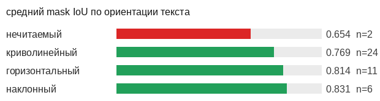
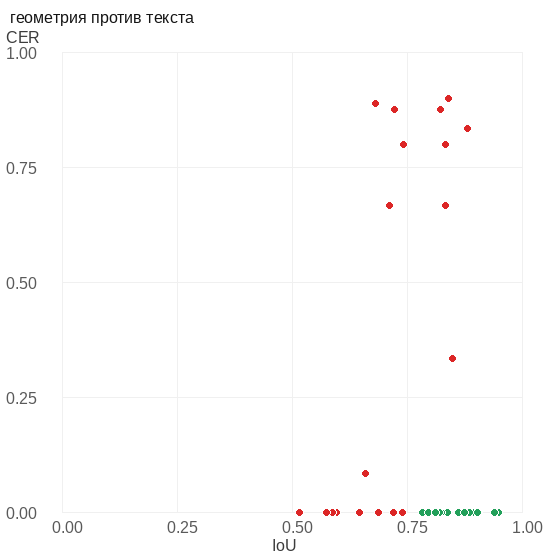
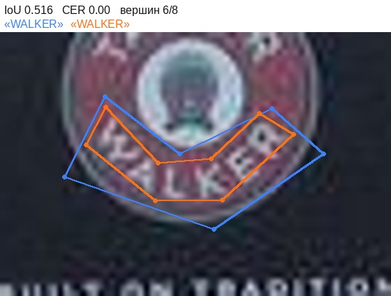
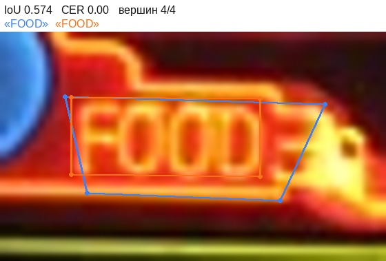
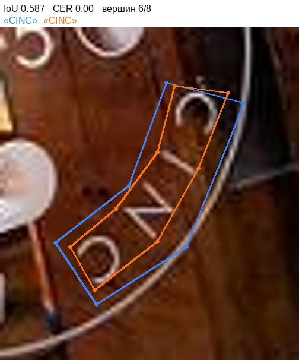
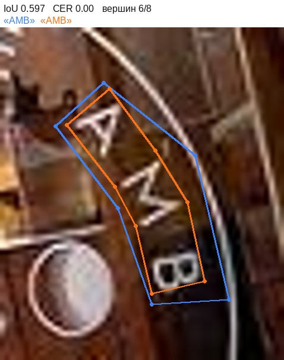
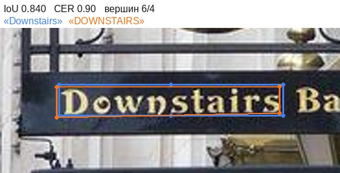
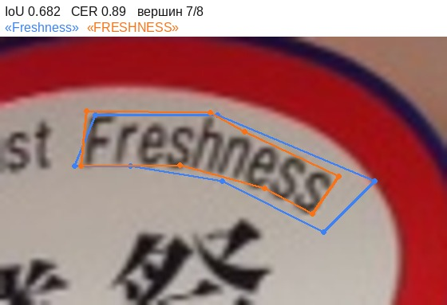
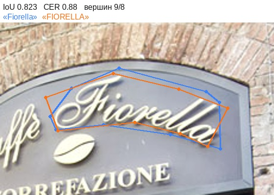
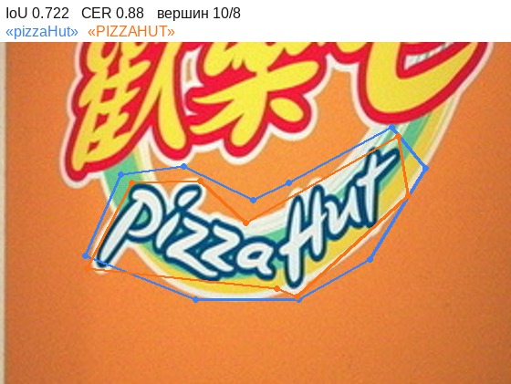

# ocr-annotation-agreement

Согласованность разметки текста в сцене: полигон по границе слова
плюс транскрипция. Каждый объект размечен дважды по сути, и метрики
тоже две, разной природы. 10 кадров Total-Text размечены вручную
вслепую от эталона.
Этап A5 портфолио по контролю качества разметки.

<!-- note:intro -->
> **Что здесь произошло:** обе стороны читали текст почти одинаково, а разошлись
> на двух правилах записи. Все четыре худшие пары по тексту — чистый регистр:
> «Downstairs» против «DOWNSTAIRS», ни одной перепутанной буквы. Убери регистр,
> и CER падает с 0.223 до 0.013 — 94% ошибки чтения оказывается конвенцией.
> Вторая половина истории геометрическая: мой контур систематически плотнее
> эталонного на 14%, и на мелких словах этого хватает, чтобы пара не сложилась
> вовсе — семь слов, прочитанных одинаково обеими сторонами, легли в IoU
> 0.41–0.49 и ушли в «без пары».
<!-- /note -->

## Результат

| | |
|---|---|
| кадров | 10 |
| объектов своих / эталонных | 79 / 67 |
| сопоставлено пар | 43 |
| **mask IoU на парах** | **0.784** |
| **CER** | **0.223** |
| WER | 0.268 |
| совпало дословно | 30 из 41 |
| согласие по «читаемо / нечитаемо» | 0.953 |
| каппа Коэна по читаемости | 0.000 |

Порог сопоставления — mask IoU 0.5. Средний IoU считается
только по сопоставленным парам, поэтому рядом обязана стоять строка
«без пары»: эталонных 24, своих 36. Объект, обведённый совсем
мимо, в пару не попадает и средний IoU не портит — он уходит туда.

## Геометрия или текст

Главный вопрос этапа. Две оси меряют разное, и усреднять их в одно
число нельзя: контур чинится правилом о границах, транскрипция —
правилом о регистре и пунктуации.

| ориентация эталонного текста | пар | средний IoU |
|---|---|---|
| нечитаемый | 2 | 0.654 |
| криволинейный | 24 | 0.769 |
| горизонтальный | 11 | 0.814 |
| наклонный | 6 | 0.831 |

Точка на пару: по горизонтали геометрия, по вертикали текст.
Расхождения, собравшиеся у одной оси, — это разные проблемы
с разными лечениями.

## Сколько ошибки объясняется конвенцией

CER как есть — **0.223**. Тот же расчёт после приведения обеих
сторон к нижнему регистру — **0.013**. Разница и есть та часть
ошибки, которая объясняется правилом записи, а не чтением: **94%**.

CER посчитан микроусреднением (правки, делённые на все 229 символов эталона);
макро, то есть среднее по объектам, дало бы 0.188. Разница между ними
тем больше, чем короче слова, поэтому в отчёте называется, какое взято.

## Читаемо или нет

Отдельная ось, которой не видят ни IoU, ни CER: объект, который я
счёл нечитаемым, а эталон прочитал, просто выпадает из расчёта CER
и молча его улучшает.

| эталон \ моё | читаемо | нечитаемо |
|---|---|---|
| читаемо | 41 | 0 |
| нечитаемо | 2 | 0 |

Доля совпадений 0.953 при каппе 0.000: каппа стоит рядом потому,
что при редком классе доля совпадений высока сама по себе.

## Разбор худших пар

Синий — эталон, оранжевый — моё. У каждой пары подписаны обе оси.

### img894.jpg · эталон #8 · геометрия

IoU 0.516 · CER 0.000 · «WALKER» против «WALKER»

<!-- note:img894_8 -->
> **Что здесь произошло:** формально худшая геометрия партии, а по картинке мой
> контур точнее эталонного. Эталон обвёл дугу шестью вершинами с большим запасом,
> восемь моих идут по глифам. Расходится отступ, а не аккуратность — правило
> о восьми вершинах на изогнутом слове сработало как задумано.
<!-- /note -->

### img548.jpg · эталон #5 · геометрия

IoU 0.574 · CER 0.000 · «FOOD» против «FOOD»

<!-- note:img548_5 -->
> **Что здесь произошло:** прямое слово, у обеих сторон по четыре вершины, и всё
> равно IoU 0.574. Эталонный четырёхугольник уводит нижнюю сторону вправо-вниз
> далеко за буквы, мой прямоугольник стоит вплотную. Чистая цена отступа.
<!-- /note -->

### img1543.jpg · эталон #3 · геометрия

IoU 0.587 · CER 0.000 · «CINC» против «CINC»

<!-- note:img1543_3 -->
> **Что здесь произошло:** короткое слово на изгибе. Постоянный запас эталона
> съедает у четырёх букв большую долю площади, чем у длинной вывески, — та же
> причина, по которой семь пар не дотянули до порога 0.5.
<!-- /note -->

### img1543.jpg · эталон #5 · геометрия

IoU 0.597 · CER 0.000 · «AMB» против «AMB»

<!-- note:img1543_5 -->
> **Что здесь произошло:** то же, что у CINC выше, и в том же кадре. Два коротких
> слова подряд — признак, что дело в правиле, а не в дрогнувшей руке.
<!-- /note -->

### img894.jpg · эталон #4 · текст

IoU 0.840 · CER 0.900 · «Downstairs» против «DOWNSTAIRS»

<!-- note:img894_4 -->
> **Что здесь произошло:** девять правок на десять символов при том, что слово
> прочитано верно до буквы. «Downstairs» против «DOWNSTAIRS» — это моё правило
> о верхнем регистре, принятое до разметки, и его цена была посчитана заранее.
<!-- /note -->

### img675.jpg · эталон #4 · текст

IoU 0.682 · CER 0.889 · «Freshness» против «FRESHNESS»

<!-- note:img675_4 -->
> **Что здесь произошло:** снова только регистр. CER 0.889 выглядит как провал
> чтения, а после приведения обеих сторон к одному регистру становится нулём.
<!-- /note -->

### img620.jpg · эталон #2 · текст

IoU 0.823 · CER 0.875 · «Fiorella» против «FIORELLA»

<!-- note:img620_2 -->
> **Что здесь произошло:** «Fiorella» против «FIORELLA». Восьмая по счёту причина
> убедиться, что CER без разбивки по конвенции не говорит ничего о разметчике.
<!-- /note -->

### img673.jpg · эталон #5 · текст

IoU 0.722 · CER 0.875 · «pizzaHut» против «PIZZAHUT»

<!-- note:img673_5 -->
> **Что здесь произошло:** «pizzaHut» — эталон передал даже внутреннюю заглавную,
> как на вывеске. Мой верхний регистр стирает это различие; ошибки чтения нет.
<!-- /note -->

## Что дальше

- Инструкция и решения по спорным случаям — [annotation/GUIDELINES.md](annotation/GUIDELINES.md)
- Полный отчёт — [reports/ocr_report.md](reports/ocr_report.md)
- Долг по написанному не мной коду — [DEBT.md](DEBT.md)

Остальные этапы портфолио по качеству разметки:

- [A2, полигоны](https://github.com/daviddolya/polygon-annotation-agreement) — mask IoU, Dice, Boundary IoU; оттуда перенесён `common/polygons.py`
- [A3, треки](https://github.com/daviddolya/tracking-annotation-agreement) — IDF1, ID switches, конвенция края кадра
- [A4, скелеты](https://github.com/daviddolya/keypoint-annotation) — OKS, PCK, согласие по видимости
- [P2, боксы](https://github.com/daviddolya/detection-annotation-quality) — kappa 0.914, средний IoU 0.867 на 100 кадрах

README пересобирается `tools/build_readme.py`; комментарии между маркерами
`<!-- note:… -->` и `<!-- /note -->` при пересборке сохраняются.
