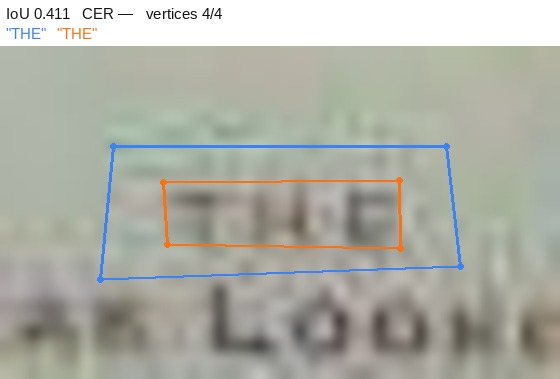
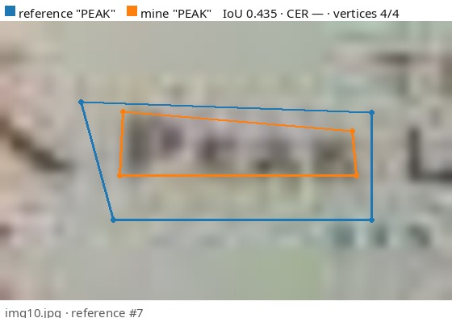
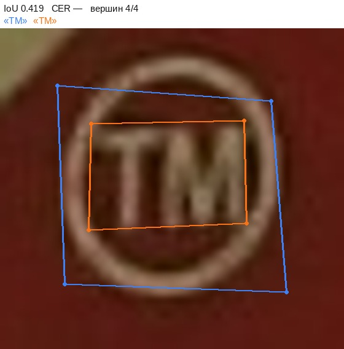
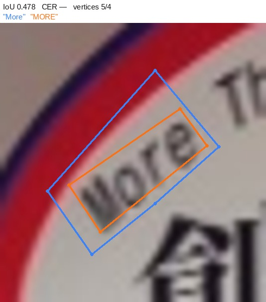
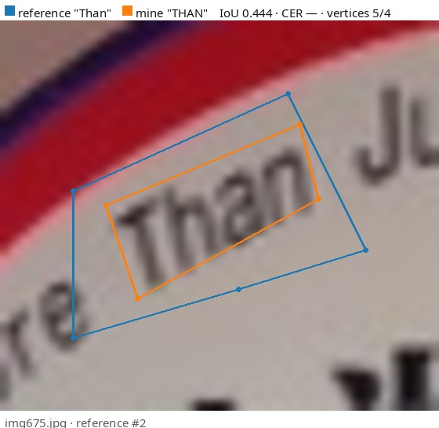
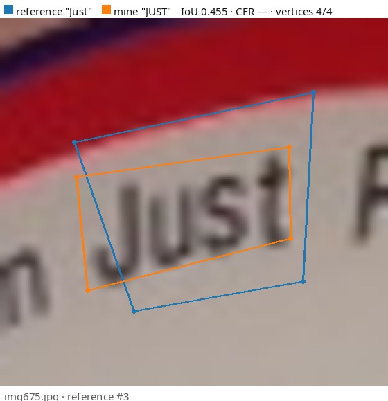
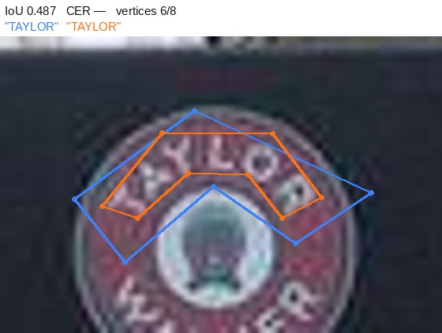

# ocr-annotation-agreement

Annotation agreement on scene text: a polygon around the word plus a
transcription. Every object is annotated twice over in effect, so there
are two metrics of different natures. 10 Total-Text frames were
annotated by hand, blind to the ground truth.
Stage A5 of an annotation-quality portfolio.

<!-- note:intro -->
> **What happened here:** both sides read the text almost identically and
> diverged on two rules of writing instead. All four worst pairs by text are
> pure case: "Downstairs" against "DOWNSTAIRS", not a single letter misread.
> Take case out and CER falls from 0.223 to 0.013 -- 94% of the reading error
> turns out to be convention. The other half of the story is geometric: my
> contour is systematically 14% tighter than the reference's, and on small
> words that is enough for a pair to fail to form at all -- seven words read
> identically by both sides landed at IoU 0.41-0.49 and went into "unmatched".
<!-- /note -->

## Result

| | |
|---|---|
| frames | 10 |
| objects, mine / reference | 79 / 67 |
| pairs matched | 43 |
| **mask IoU over pairs** | **0.784** |
| **CER** | **0.223** |
| WER | 0.268 |
| exact matches | 30 of 41 |
| agreement on legible / illegible | 0.953 |
| Cohen's kappa on legibility | 0.000 |

The matching threshold is mask IoU 0.5. Mean IoU is computed
only over matched pairs, which is why the unmatched counts have to stand
next to it: 24 reference objects and 36 of mine. A word drawn completely
off target never enters a pair and never hurts the mean -- it lands there.

## Geometry or text

The central question of the stage. The two axes measure different things
and cannot be averaged into one number: a contour is fixed by a rule about
boundaries, a transcription by a rule about case and punctuation.

| orientation of the reference text | pairs | mean IoU |
|---|---|---|
| illegible | 2 | 0.654 |
| curved | 24 | 0.769 |
| horizontal | 11 | 0.814 |
| slanted | 6 | 0.831 |


One point per pair: geometry along the horizontal axis, text along the
vertical. Disagreements that pile up against one axis are a different
problem with a different cure.


## How much of the error is convention

CER as measured is **0.223**. The same computation after folding both
sides to lowercase gives **0.013**. The gap is exactly the part of
the error explained by the writing rule rather than by reading: **94%**.

CER is micro-averaged (edits divided by all 229 reference characters);
macro-averaging, the mean over objects, would give 0.188. The gap between
the two widens as words get shorter, so a report says which one it quotes.

## Legible or not

A separate axis that neither IoU nor CER can see: an object I called
illegible and the reference read simply drops out of the CER computation
and silently improves it.

| reference \ mine | legible | illegible |
|---|---|---|
| legible | 41 | 0 |
| illegible | 2 | 0 |

Raw agreement 0.953 against a kappa of 0.000. The kappa stands next to it
because with a rare class the raw share is high all by itself.

## The worst pairs

Blue is the reference, orange is mine. Both axes are quoted for each.

### img894.jpg · reference #8 · geometry

IoU 0.516 · CER 0.000 · "WALKER" against "WALKER"


<!-- note:img894_8 -->
> **What happened here:** formally the worst geometry of the batch, and by the
> picture my contour is the more accurate one. The reference outlined the arc
> with six vertices and a generous margin; my eight follow the glyphs. What
> diverges is the offset, not the care -- the eight-vertices-on-curved-text
> rule did exactly what it was meant to.
<!-- /note -->

### img548.jpg · reference #5 · geometry

IoU 0.574 · CER 0.000 · "FOOD" against "FOOD"


<!-- note:img548_5 -->
> **What happened here:** a straight word, four vertices on each side, and IoU
> still 0.574. The reference quadrilateral runs its lower edge down and to the
> right well past the letters; my rectangle sits against them. The pure price
> of the offset.
<!-- /note -->

### img1543.jpg · reference #3 · geometry

IoU 0.587 · CER 0.000 · "CINC" against "CINC"


<!-- note:img1543_3 -->
> **What happened here:** a short word on a bend. A constant margin eats a
> larger share of four letters than of a long sign -- the same reason the
> seven split pairs below never reached the 0.5 threshold.
<!-- /note -->

### img1543.jpg · reference #5 · geometry

IoU 0.597 · CER 0.000 · "AMB" against "AMB"


<!-- note:img1543_5 -->
> **What happened here:** the same as CINC above, and in the same frame. Two
> short words in a row is a sign that the cause is a rule rather than an
> unsteady hand.
<!-- /note -->

### img894.jpg · reference #4 · text

IoU 0.840 · CER 0.900 · "Downstairs" against "DOWNSTAIRS"


<!-- note:img894_4 -->
> **What happened here:** nine edits over ten characters, on a word read
> correctly letter for letter. "Downstairs" against "DOWNSTAIRS" is my
> uppercase rule, adopted before annotating, and its price was measured in
> advance.
<!-- /note -->

### img675.jpg · reference #4 · text

IoU 0.682 · CER 0.889 · "Freshness" against "FRESHNESS"


<!-- note:img675_4 -->
> **What happened here:** case again, and nothing else. CER 0.889 looks like a
> failure of reading and becomes zero the moment both sides are folded to the
> same case.
<!-- /note -->

### img620.jpg · reference #2 · text

IoU 0.823 · CER 0.875 · "Fiorella" against "FIORELLA"


<!-- note:img620_2 -->
> **What happened here:** "Fiorella" against "FIORELLA". One more reason to
> distrust a CER quoted without a breakdown by convention -- it says nothing
> about the annotator on its own.
<!-- /note -->

### img673.jpg · reference #5 · text

IoU 0.722 · CER 0.875 · "pizzaHut" against "PIZZAHUT"


<!-- note:img673_5 -->
> **What happened here:** "pizzaHut" -- the reference even carried the medial
> capital through, as it appears on the sign. My uppercase rule erases that
> distinction; there is no reading error here at all.
<!-- /note -->

## Split pairs

7 objects that both sides found and read identically, and
that still formed no pair: the contours disagreed enough to fall under
the matching threshold of 0.5. All of them land between
0.411 and 0.487 -- just short of it.

This category is invisible in the tables above. It hides inside the
unmatched counts, where nothing distinguishes it from a word one side
never annotated at all, even though the two mean opposite things: one is
a miss, the other is a boundary convention. The name is borrowed from
stage A2, where the same thing happened to polygons.

### img10.jpg · "THE"

IoU 0.411 · vertices 4/4 · read identically



<!-- note:split_img10_6 -->
> **What happened here:** the clearest case in the set. Both sides drew THE and
> both read it THE. The reference box (blue) carries a wide margin on every
> side; mine (orange) sits against the glyphs. On a three-letter word that
> margin is most of the area, so IoU comes to 0.411 and the pair never forms.
<!-- /note -->

### img10.jpg · "PEAK"

IoU 0.435 · vertices 4/4 · read identically



<!-- note:split_img10_7 -->
> **What happened here:** PEAK in the same frame, the same margin, the same
> outcome. Two objects from one frame is what turns this from an accident into
> a convention difference.
<!-- /note -->

### img578.jpg · "TM"

IoU 0.419 · vertices 4/4 · read identically



<!-- note:split_img578_5 -->
> **What happened here:** TM, two characters. The shorter the word, the more of
> its area a constant margin occupies -- which is why the split pairs are all
> short words rather than difficult ones.
<!-- /note -->

### img675.jpg · "More"

IoU 0.478 · vertices 5/4 · read identically



<!-- note:split_img675_1 -->
> **What happened here:** MORE THAN JUST is set as three separate objects on
> both sides, and all three fail the threshold together. When a whole phrase
> goes at once, the cause is the rule, not the individual outline.
<!-- /note -->

### img675.jpg · "Than"

IoU 0.444 · vertices 5/4 · read identically



<!-- note:split_img675_2 -->
> **What happened here:** the second word of the same phrase. The reference
> spends five vertices, I spend four, and the difference is still the offset
> rather than the shape.
<!-- /note -->

### img675.jpg · "Just"

IoU 0.455 · vertices 4/4 · read identically



<!-- note:split_img675_3 -->
> **What happened here:** the third word of the phrase, IoU 0.455. Three
> objects lost from one sign is the price of a single unstated sentence about
> how close to the glyphs the contour runs.
<!-- /note -->

### img894.jpg · "TAYLOR"

IoU 0.487 · vertices 6/8 · read identically



<!-- note:split_img894_7 -->
> **What happened here:** the exception that proves the rule -- here the shapes
> genuinely differ. TAYLOR arcs across a badge; the reference sketches it with
> six vertices and a lot of slack, my eight follow the curve. My contour is the
> better one and it is still the one that falls out of the pairing, because the
> threshold measures agreement rather than quality.
<!-- /note -->

## Reproduce

Python 3.10+ with numpy and Pillow.

```bash
python3 -m venv .venv && .venv/bin/pip install -r requirements.txt

# the five self-test cases with answers known in advance,
# including the one where CER comes out at 1.667
.venv/bin/python common/text.py --selftest

# the Total-Text ground truth, test split: 300 files, 257 KB
.venv/bin/python tools/fetch_totaltext.py --out data/totaltext/gt

# sanity-check the export before computing anything
.venv/bin/python tools/check_export.py \
    --mine annotation/my_labels --selection data/subset/selection_text.json

# the numbers in this README
.venv/bin/python annotation/ocr_agreement.py \
    --gt data/totaltext/gt --mine annotation/my_labels \
    --selection data/subset/selection_text.json \
    --out reports/ocr_metrics.json

# the pictures above, then this README
.venv/bin/python tools/render_text.py \
    --gt data/totaltext/gt --mine annotation/my_labels \
    --images data/subset/frames \
    --selection data/subset/selection_text.json --out reports/review
.venv/bin/python tools/build_readme.py
```

The 10 frames and my annotation are committed; the ground truth is 257 KB
and comes down in one command, so every number reproduces from a fresh
clone.

## What else is here

- Annotation guidelines and the disputed-case decisions — [annotation/GUIDELINES.md](annotation/GUIDELINES.md)
- Full report — [reports/ocr_report.md](reports/ocr_report.md)
- Code I did not write myself, and what I owe an explanation for — [DEBT.md](DEBT.md)

## The other stages of this portfolio

| stage | type | headline numbers |
|---|---|---|
| P2 | [boxes](https://github.com/daviddolya/detection-annotation-agreement) | kappa 0.914, mean IoU 0.867 |
| A2 | [polygons and masks](https://github.com/daviddolya/polygon-annotation-agreement) | mask IoU 0.840, Boundary IoU 0.676 |
| A3 | [tracks on video](https://github.com/daviddolya/tracking-annotation-agreement) | IDF1 0.896, 2 ID switches |
| A4 | [skeletons](https://github.com/daviddolya/keypoint-annotation-agreement) | OKS 0.895, flag agreement 0.822 |
| A5 | scene text — **this repository** | mask IoU 0.784, CER 0.223 |

`common/polygons.py` is ported from stage A2 with a note on its provenance.

The README is rebuilt by `tools/build_readme.py`; the commentary between the
`<!-- note:… -->` and `<!-- /note -->` markers survives a rebuild.
